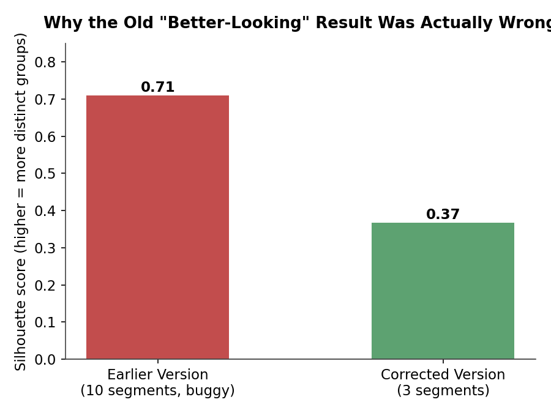
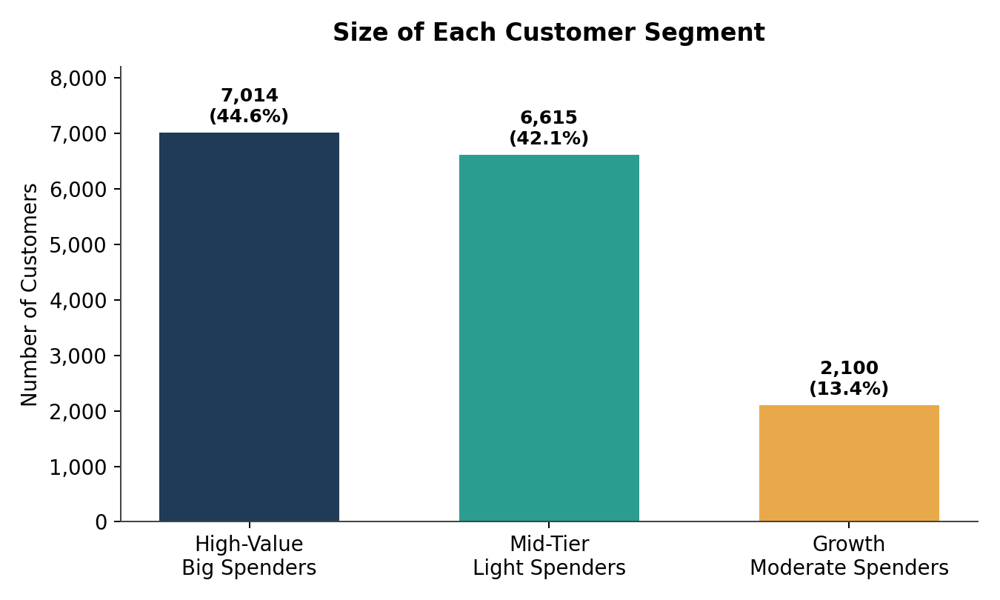
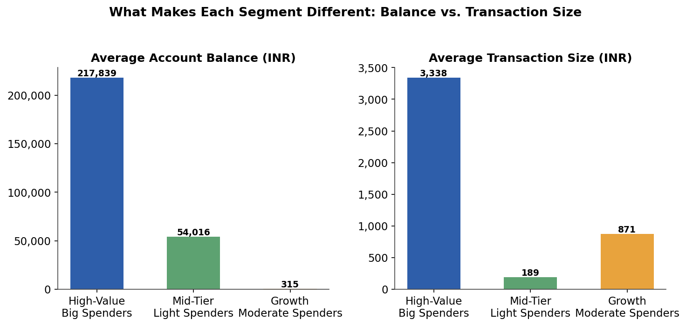
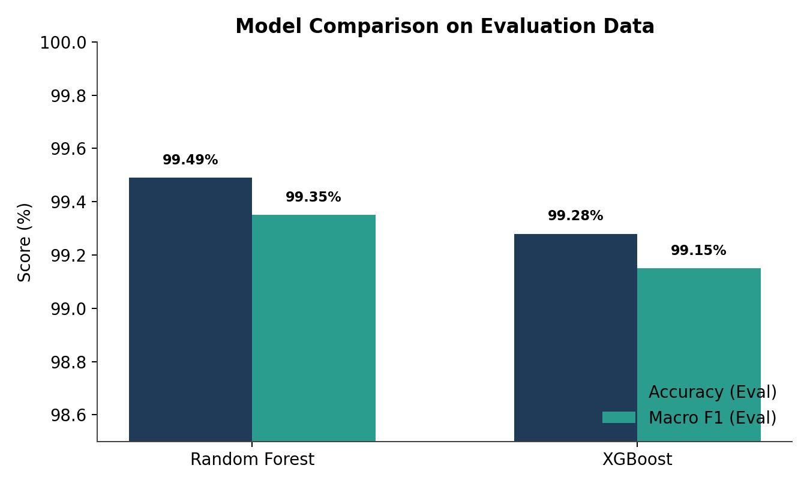
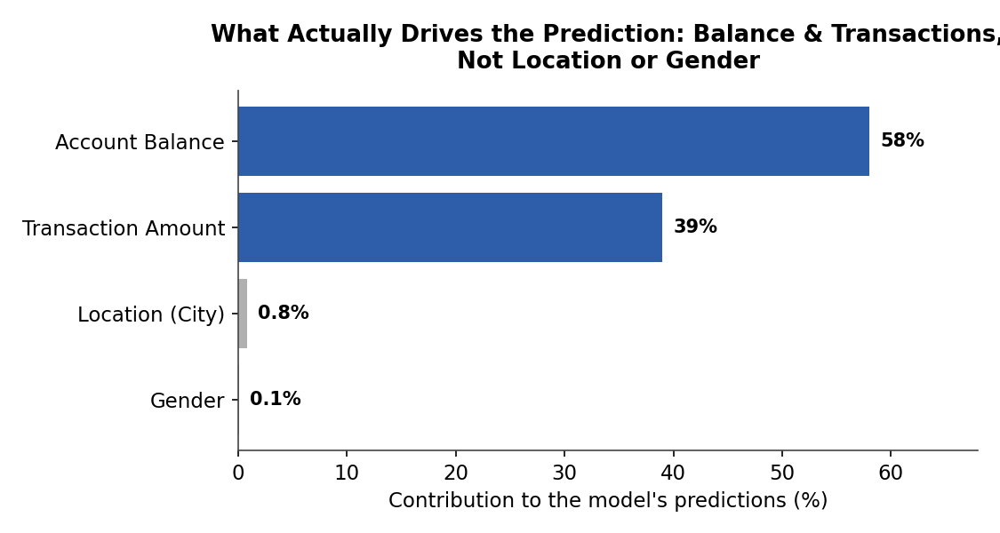

# Bank Customer Segmentation: From Raw Transactions to Predictable Segments

This project builds a **bank customer segmentation** from raw transaction data, then trains a classification model that can instantly predict which segment a new customer belongs to — without needing to re-run the clustering process every time a new customer signs up.

The end result: **3 customer segments** formed purely from financial behavior (balance and transaction size), and a **Random Forest** model that predicts a new customer's segment with **99.1% accuracy** on data it has never seen before. The saved pipeline can score a new customer in milliseconds.

An earlier version of this analysis reported a result that looked more impressive at first glance — 10 segments named after cities, with a silhouette score of 0.71. On closer inspection, that number turned out to come from a bug: an unscaled location column dominated every distance calculation in K-Means, so the model was effectively grouping customers by the alphabetical order of their city name — not by their transaction behavior. This document walks through the corrected version, alongside a comparison with the earlier, flawed one.

---

## Background

The bank processes millions of transactions every day, yet treats nearly all customers the same way. A customer with a large balance and steady, recurring transactions needs a different approach than one making small, infrequent transactions — but marketing still sends the same offers to both, and the risk team struggles to know which accounts deserve closer attention.

The problem is that raw transaction data carries no segment label. Nothing in the columns says "premium customer" or "high-risk customer." This project builds that label from scratch: cluster historical transactions into groups, then train a classifier that can place a new customer into the right segment the moment they sign up, without waiting for the clustering to be re-run.

---

## Business Questions

| # | Business Question | Short Answer |
|---|---|---|
| **BQ1** | Does the data actually contain meaningful customer groupings? | Yes — silhouette score 0.37, a moderate but genuine structure |
| **BQ2** | What separates one segment from another? | Account balance and transaction size. **Not** location, **not** gender |
| **BQ3** | Can we predict a new customer's segment without re-clustering? | Yes — a saved pipeline scores one new customer in milliseconds |
| **BQ4** | Which model should the business trust? | Random Forest — 99.1% accuracy, checked once on data the model truly never saw |

---

## Dataset

- Historical bank customer transaction data, with key columns: account balance (`CustAccountBalance`), transaction value, customer location (`CustLocation`, 1,595 unique cities), and gender.
- Account balance ranges from near zero to 82 million INR, with a median of 17,000 INR — a heavily skewed distribution, which is why both monetary columns were log-transformed before entering the clustering step.
- The analysis in this document runs on a **1.5% sample of the full transaction history (15,729 rows)**. Directional findings (number of segments, distinguishing features) are expected to hold at full scale, but the exact silhouette and accuracy figures should be re-checked once the full dataset is available.
- Two notebooks drive this project's workflow:
  1. **`Clustering_Perfected.ipynb`** — reads the raw transactions, forms the 3 segments, and outputs `clustered_data_fixed.csv` and `cluster_profile.csv`.
  2. **`Classification_Perfected.ipynb`** — reads both files, trains and compares Random Forest vs. XGBoost, and saves a ready-to-use scoring pipeline (`segment_classifier.pkl` plus its preprocessing artifacts).

---

## Methodology

1. **Data preparation before clustering.** The heavily skewed balance and transaction columns were log-transformed, then every numeric feature entering K-Means was scaled to the same standard. The location column (1,595 city categories) was **excluded** from the clustering step entirely — used only for profiling afterward, not as an input that shapes the segments.
2. **Finding the optimal number of segments.** K-Means was run for cluster counts from 2 to 10, each scored with the silhouette metric, to find the number of segments that emerges naturally from the data — not one forced onto it.
3. **Segment profiling.** Each resulting segment was checked across variables (balance, transaction value, dominant city, gender) to confirm the differentiator is genuinely financial behavior, not an encoding artifact.
4. **Classifier training.** Random Forest and XGBoost were trained to predict the segment label from raw customer data, first compared on an **evaluation set** (not the test set) to select the model and tune hyperparameters.
5. **A single final check.** The best model (tuned Random Forest) was then evaluated on a **separate test set**, checked only **once** — after every modeling decision had already been made — so the final accuracy figure wasn't "leaked" into the tuning process.
6. **Ready-to-deploy pipeline.** The encoder, imputer, scaler, and trained model were saved as a single pipeline that can be called directly to score a new customer, including one from a city that never appeared in the training data (falls back to a neutral value instead of erroring out).

---

## Key Findings

### 1. The data does contain a genuine grouping structure — moderate, but more honest than what was previously reported

Searching k=2 through k=10 finds the best split at **k=3, silhouette score 0.3665**. A score above zero means the segments separate better than random assignment would; 0.37 falls into the "moderate but real structure" range — well short of the 0.5+ threshold that would usually signal customers falling into very sharply distinct groups.

The earlier version reported a silhouette of 0.71 with 10 clusters — it looked far more convincing, but that number was a symptom of a bug, not a better result: the location column, label-encoded into integers from 0–1,594 without scaling, dominated every distance calculation, so the model was essentially just sorting customers by the alphabetical rank of their city name.

### 2. Segments are separated by balance and transaction size — not location, not gender

| Segment | Avg. Balance (INR) | Avg. Transaction (INR) | Customers | Share |
|---|---:|---:|---:|---:|
| High-Value – Big Spenders | 217,839 | 3,338 | 7,014 | 44.6% |
| Mid-Tier – Light Spenders | 54,016 | 189 | 6,615 | 42.1% |
| Growth – Moderate Spenders | 315 | 871 | 2,100 | 13.4% |

Two things stand out from this table:

- **The Growth segment holds almost no balance** (an average of 315 INR), yet its transaction value is actually larger than the Mid-Tier segment's (871 vs. 189 INR). This pattern looks more like customers who let their balance run close to zero between transactions, rather than customers who simply have less money — a pattern worth the risk team's attention, and a potential conversion opportunity for marketing.
- **Location and gender are not segment drivers.** The most common city in each segment never accounts for more than 11.6% of that segment's customers, and the same city (Mumbai) tops all three segments. If location truly drove the segmentation, each segment should concentrate heavily in one region — it doesn't. Gender shows the same pattern: the male proportion in every segment is roughly in line with the overall dataset.

**What this means for the business:** marketing campaigns and risk rules should be built around balance and transaction size, not the customer's city. A campaign like "premium banking exclusively for Gurgaon" is targeting the wrong signal — a premium customer in Gurgaon looks financially identical to one in Chennai.

### 3. New customers can be classified instantly, without re-running clustering

The saved pipeline — the fitted encoder, imputer, scaler, and trained Random Forest model — can score a new customer and return their segment in milliseconds, with no need for historical data or re-running K-Means. Even for a customer from a city that never appeared in the training data, the pipeline still returns a result (falling back to a neutral value) instead of failing outright. This is what turns the clustering output into something a loan-onboarding flow, mobile banking sign-up, or CRM lookup can call directly, the moment a new customer's first transaction comes in.

### 4. Random Forest is the model worth trusting — and its feature importance makes sense

Random Forest and XGBoost were first compared on the evaluation set (Random Forest came out slightly ahead on both metrics), then Random Forest was tuned and evaluated **once** on a fully separate test set:

**Random Forest, test set, first and only look: 99.11% accuracy, 99.02% macro F1.**

The earlier version created a train/eval/test split but never actually used the eval set — the test set doubled as both the tuning ground and the final report card. That risks an optimistic final number, since the model effectively gets tuned toward the same data it's later scored on.

Accuracy this high makes sense because the segments were built directly from balance and transaction size, and the classifier has access to those same two numbers. **Balance (58%) and transaction amount (39%) account for 98% of the model's total feature contribution**, while location and gender play almost no role (0.8% and 0.1%). This is the honest version of a story the earlier notebook told for the wrong reason: back then, location dominated feature importance at 91%, because the model was simply rediscovering the same bug — not learning a genuine relationship.

---

## Recommendations

- **Use balance and transaction size as the basis for campaign segmentation and risk policy** — not the customer's city or gender. These two features account for 98% of the signal separating segments; location has been shown to be irrelevant for this purpose.
- **Manually review the Growth segment before treating it as simply "low value."** Near-zero balance combined with transaction sizes above the Mid-Tier segment's average is better suited to a risk-team review, and a potential candidate for marketing to convert into savers, rather than being written off outright.
- **Integrate the classification pipeline into the onboarding system** (mobile banking sign-up, loan applications, or CRM lookup) so a new customer's segment is known from their very first transaction, without waiting for the next batch clustering run.
- **Re-validate these figures on the full dataset** before using them for large-scale decisions — this analysis runs on only a 1.5% sample of the full transaction history.
- **Don't discard the location column from every model entirely** — it has been shown to be irrelevant for spending-behavior segmentation, but it may still be useful for other purposes such as fraud detection or branch staffing decisions.
- **Maintain the eval-vs-test discipline on future machine learning projects at this bank** — the clear separation between tuning data and final-reporting data is what makes the 99.1% figure in this project trustworthy.

---

## Conclusion

The bank's transaction data does contain a genuine customer grouping — three segments separated by account balance and transaction size, not by customer location or gender. This grouping structure is moderate (silhouette 0.37) rather than sharply distinct, but it's far more honest than the earlier version, whose high-looking silhouette (0.71) turned out to be a location-encoding bug.

The resulting segments — High-Value Big Spenders, Mid-Tier Light Spenders, and Growth Moderate Spenders — can be predicted for new customers with 99.1% accuracy through a Random Forest pipeline that's ready to plug directly into the onboarding system, with no need to re-run clustering. With a clear foundation in balance and transaction size, the bank has a stronger basis for targeting marketing campaigns and risk rules more precisely — and a reminder that numbers which look "too good" (a 0.71 silhouette, 91% feature importance for location) are worth scrutinizing before they're used to drive decisions.
